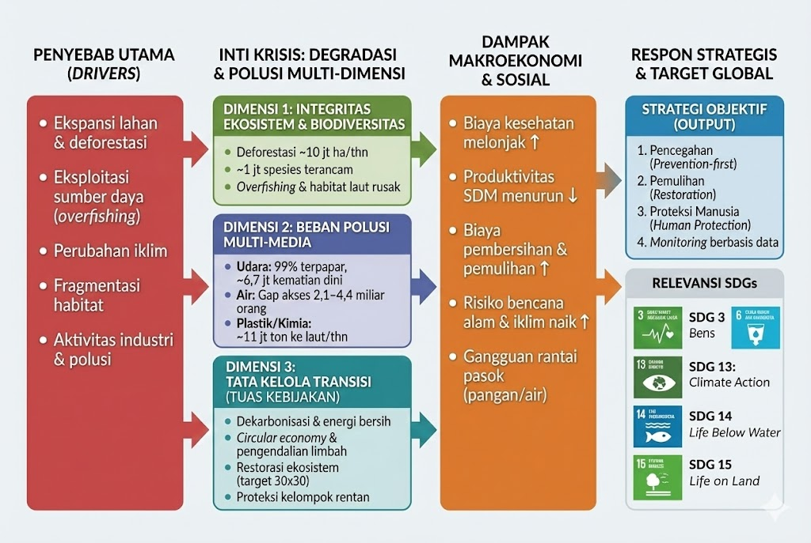

## UAS-1 My Concepts

## Kerangka Integrasi Ketahanan Lingkungan Global

**Note — Abstrak Konsep**  
Konsep ini menempatkan hak atas lingkungan yang bersih dan sehat sebagai fondasi stabilitas sosial–ekonomi makro. Variabel kuncinya adalah kualitas lingkungan (integritas ekosistem + beban polusi) yang secara langsung memengaruhi kesehatan, produktivitas tenaga kerja, ketahanan pangan–air, serta risiko bencana.

### Pendahuluan

#### Ringkasan Alur (Flowchart)
{fig-cap="Flowchart: Drivers → Dimensi → Dampak → Strategi → SDGs" width=100%}

Konsep “Degradasi Lingkungan dan Polusi” menganalisis krisis lingkungan global sebagai sistem yang saling terhubung, bukan isu terpisah. Struktur konseptual ini membagi tantangan menjadi tiga dimensi utama:

- **Integritas Ekosistem & Keanekaragaman Hayati** — kerusakan penopang kehidupan (hutan, laut, tanah, biodiversitas)
- **Beban Polusi Multi-Media** — pencemaran udara, air, dan tanah (termasuk plastik & bahan kimia beracun)
- **Tata Kelola Transisi & Resiliensi** — kapasitas kebijakan untuk menekan emisi/polusi, memulihkan ekosistem, dan melindungi populasi rentan

### Dimensi Integritas Ekosistem & Keanekaragaman Hayati

**Warning — Kerusakan Penopang Kehidupan**  
Dimensi pertama membahas degradasi ekosistem yang mengurangi “jasa alam” seperti penyediaan oksigen, penyerapan karbon, penyangga banjir, dan sumber pangan.

#### Data dan Fakta Kunci

- Deforestasi global (2015–2020): ~10 juta hektare per tahun.  
  FAOHome

- ~1 juta spesies diperkirakan terancam punah (banyak “dalam beberapa dekade”) akibat tekanan manusia.  
  IPBES

- Kerusakan ekosistem laut juga dipacu oleh eksploitasi berlebih dan degradasi habitat (contoh: stok ikan tidak berkelanjutan/overfished masih menjadi perhatian global).  
  Reuters

#### Faktor Penyebab (Driver)

- Ekspansi lahan (pertanian/perkebunan), pembalakan, kebakaran hutan
- Perusakan habitat & fragmentasi wilayah alami
- Eksploitasi sumber daya berlebih (mis. penangkapan ikan)
- Perubahan iklim (mempercepat tekanan ekosistem)
- Polusi (memperburuk kualitas tanah, air, dan rantai makanan)

**Important**  
Jika integritas ekosistem runtuh, biaya ekonomi meningkat melalui hilangnya produktivitas, kerusakan aset, ketidakstabilan pangan/air, dan risiko bencana yang lebih sering.

### Dimensi Beban Polusi Multi-Media

**Warning — Polusi sebagai Krisis Kesehatan Publik & Ekonomi**  
Dimensi kedua menekankan bahwa polusi bukan sekadar “isu lingkungan”, tetapi risiko kesehatan terbesar dan penggerak biaya sosial–ekonomi.

#### Polusi Udara (Ambient + Household)

- WHO melaporkan 99% populasi global menghirup udara yang melampaui ambang pedoman WHO.  
  World Health Organization

- Dampak mortalitas: gabungan polusi udara luar-ruang dan rumah tangga terkait ~6,7 juta kematian dini per tahun.  
  World Health Organization

#### Polusi Air (Minum & Paparan)

- Estimasi resmi pemantauan global (WHO/UNICEF): sekitar 2,1 miliar orang masih tidak memiliki akses “safely managed drinking water”.  
  World Health Organization

- Studi di Science (2024) menunjukkan estimasi bisa lebih besar: ~4,4 miliar orang di LMICs diperkirakan kekurangan layanan air minum “safely managed” (terutama karena kontaminasi fekal dan akses).  
  Science

Catatan konsep: Perbedaan angka ini penting untuk analisis kebijakan—bukan kontradiksi sederhana, tetapi menunjukkan gap data & metode pengukuran.

#### Polusi Tanah, Plastik, dan Bahan Kimia

- UNEP mengestimasi ~11 juta ton plastik masuk ke laut setiap tahun (tanpa aksi, berisiko meningkat).  
  UNEP - UN Environment Programme

- Polutan kimia (mis. merkuri) berdampak langsung pada kesehatan dan ekosistem; respons global mencakup perjanjian seperti Minamata Convention.  
  Minamata Convention

#### Dampak Makroekonomi

Polusi memicu:

- Biaya kesehatan naik (penyakit pernapasan/kardiovaskular, kanker, dll.)
- Penurunan produktivitas tenaga kerja dan kualitas SDM
- Biaya mitigasi & pembersihan lingkungan
- Gangguan rantai pasok (air bersih, pangan, energi) dan meningkatnya risiko bencana iklim

### Dimensi Tata Kelola Transisi & Resiliensi

**Warning — Kapasitas Negara Menentukan “Trajektori” Krisis**  
Dimensi ketiga mengukur kemampuan sistem (negara/kota/komunitas) untuk mengubah lintasan degradasi lewat regulasi, insentif ekonomi, dan perlindungan sosial.

#### Tuas Kebijakan Kunci

- Dekarbonisasi energi & transportasi (menekan polusi udara + emisi GRK)
- Pengendalian limbah industri/pertanian (air & tanah) + peningkatan IPAL
- Circular economy: pengurangan plastik sekali pakai, desain ulang kemasan, EPR (extended producer responsibility)
- Konservasi & restorasi: perlindungan kawasan bernilai biodiversitas tinggi, rehabilitasi hutan/mangrove/DAS
- Perlindungan kelompok rentan: adaptasi bencana, akses air bersih, peringatan dini, layanan kesehatan

#### Indikator Tata Kelola (contoh metrik)

- Standar & pemantauan kualitas udara (PM2.5, NO₂) + kepatuhan emisi
- Cakupan layanan air minum aman & uji kualitas mikrobiologi/kimia
- Laju deforestasi & luas restorasi tahunan
- Tingkat kebocoran sampah plastik ke ekosistem per tahun
- Proporsi kawasan lindung efektif (mis. arah kebijakan “30x30” melindungi 30% daratan & lautan pada 2030)  
  UNEP - UN Environment Programme

### Sintesis dan Indikator Pencapaian

#### Keterkaitan SDGs

- SDG 13 (Climate Action) — emisi & ketahanan bencana
- SDG 14 (Life Below Water) — sampah plastik, ekosistem laut, perikanan
- SDG 15 (Life on Land) — deforestasi, habitat, biodiversitas
- SDG 3.9 — pengurangan kematian/penyakit akibat polusi  
  World Health Organization
- SDG 6.1 — akses air minum aman

####  Data kunci krisis lingkungan global

| Indikator | Nilai (global) | Catatan |
|---|---:|---|
| Paparan udara tercemar | ~99% populasi | Di atas pedoman WHO  \nWorld Health Organization \n |
| Kematian dini terkait polusi udara | ~6,7 juta/tahun | Ambient + household  \nWorld Health Organization \n |
| Kekurangan air minum “safely managed” (JMP) | ~2,1 miliar orang | Estimasi pemantauan global  \nWorld Health Organization \n |
| Estimasi alternatif layanan air aman (Science 2024, LMICs) | ~4,4 miliar orang | Mengindikasikan gap data/metode  \nScience \n |
| Deforestasi | ~10 juta ha/tahun (2015–2020) | Estimasi FAO  \nFAOHome \n |
| Plastik ke laut | ~11 juta ton/tahun | Estimasi UNEP  \nUNEP - UN Environment Programme \n |
| Spesies terancam | ~1 juta spesies | Estimasi IPBES  \nIPBES \n |

### Strategi Objektif

Untuk menekan degradasi lingkungan dan polusi secara sistemik, diperlukan integrasi tiga dimensi melalui:

- Pencegahan (prevention-first): standar emisi/limbah, energi bersih, transport publik, tata kelola sampah
- Pemulihan (restoration): restorasi hutan/DAS, rehabilitasi pesisir & ekosistem kritis
- Proteksi manusia (human protection): air bersih, layanan kesehatan, adaptasi bencana, jaring pengaman sosial
- Monitoring berbasis data: sensor kualitas udara, uji air, audit limbah, pelaporan transparan

**Tip — Kesimpulan**  
Jika integritas ekosistem terjaga, polusi ditekan, dan tata kelola transisi kuat, negara akan memperoleh “dividen” makro: kesehatan meningkat, produktivitas naik, risiko bencana turun, dan pertumbuhan ekonomi lebih stabil serta inklusif.
