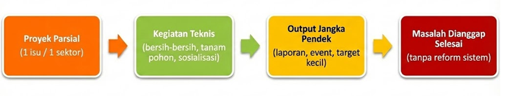
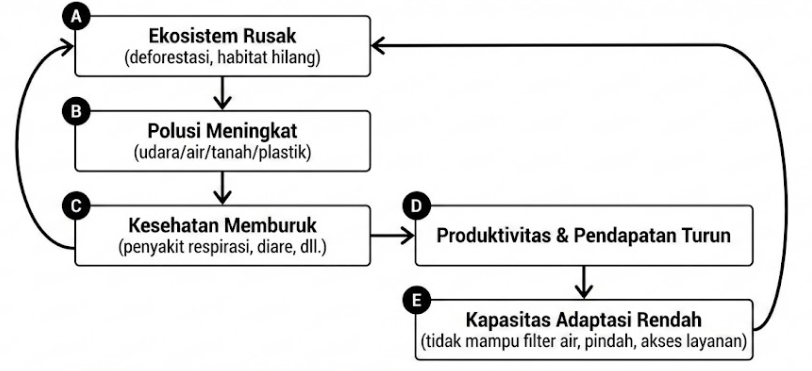
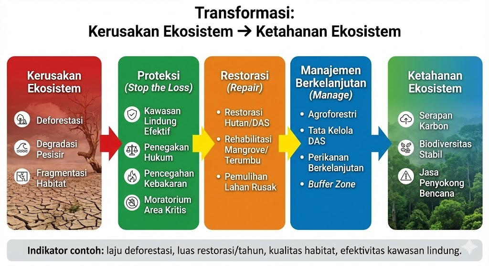
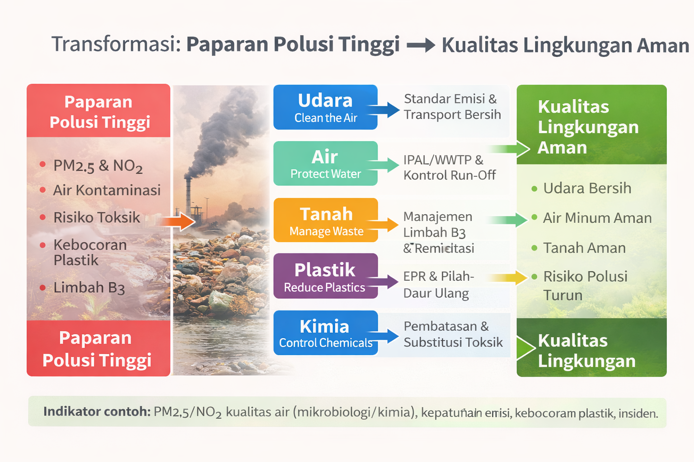
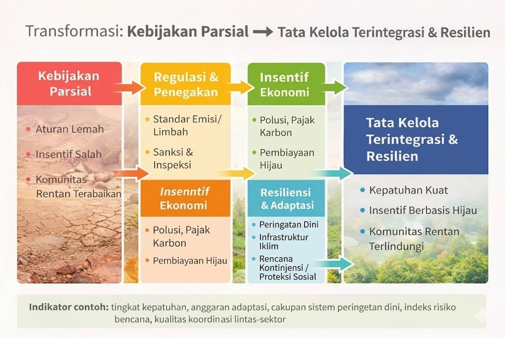
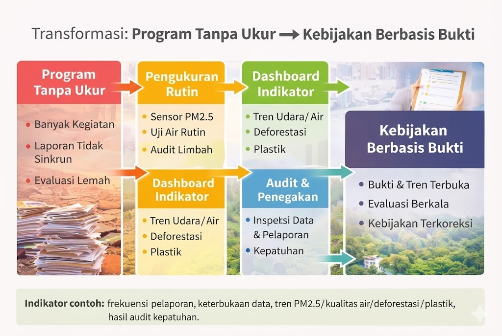
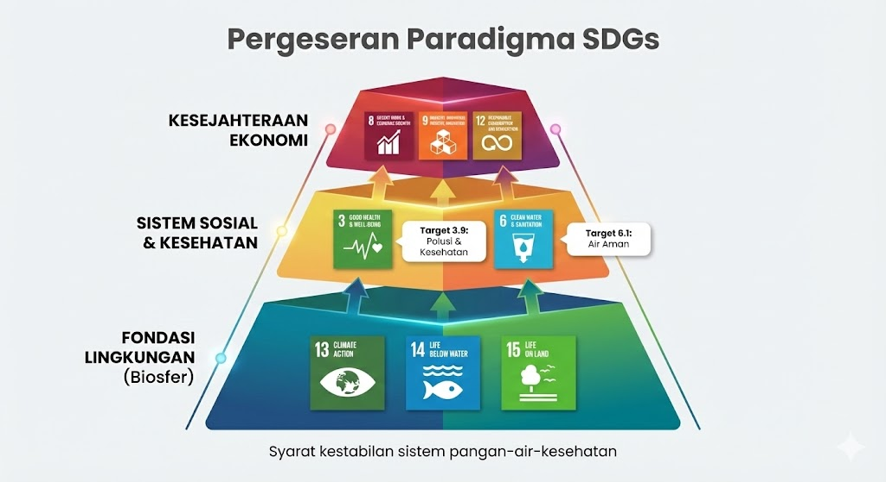

## Rekonstruksi Ketahanan Lingkungan melalui Strategi “ECO-SHIELD”

::: {.callout-note}
## Posisi Opini
Opini ini menyoroti perlunya **pergeseran paradigma**: degradasi lingkungan dan polusi harus diperlakukan sebagai **krisis sistemik** (ekosistem + polusi + tata kelola), bukan sekadar proyek terpisah seperti “tanam pohon sekali”, “bersih-bersih pantai”, atau “kampanye hemat listrik” tanpa desain kebijakan yang menyatu.
:::

## Kerangka Kegagalan Sistemik: Degradasi Lingkungan & Polusi

### Karakteristik Model Linear (Pendekatan Konvensional)

{fig-cap="Model Linear-Konvensional Penanganan Lingkungan" width=100%}

#### Asumsi Model
1. Jika ada program teknis (mis. tanam pohon / bersih pantai / sosialisasi), maka masalah lingkungan dianggap **berkurang otomatis**.
2. Polusi bisa diselesaikan **satu per satu** (udara saja / air saja / sampah saja), tanpa integrasi lintas-sektor.
3. Dampak ekonomi dianggap **tidak langsung**, sehingga prioritas kebijakan bisa ditunda.
4. Keberhasilan diukur dari **output jangka pendek** (jumlah kegiatan, peserta, laporan), bukan dari **perubahan indikator** (PM2.5, kualitas air, laju deforestasi, kebocoran plastik).

---

### Bukti Kegagalan: Data Global (FAO/WHO/UNEP/IPBES)

::: {.callout-warning} 
Model linear gagal karena krisis lingkungan itu **multi-sumber** dan **saling memperkuat**: kerusakan ekosistem → polusi meningkat → kesehatan menurun → biaya publik naik → kapasitas pemulihan makin lemah.
:::

**Indikator krisis (ringkas):**
- **Deforestasi**: ~10 juta ha/tahun (2015–2020)
- **Biodiversitas**: ~1 juta spesies terancam
- **Polusi udara**: ~99% populasi terpapar di atas pedoman WHO
- **Kematian dini akibat polusi udara**: ~6,7 juta/tahun
- **Air minum aman**: gap 2,1–4,4 miliar orang (perbedaan estimasi menunjukkan gap data & metode)
- **Plastik ke laut**: ~11 juta ton/tahun

---

### Analisis Opportunity Cost & Risiko (berdasarkan konteks)

**Table 7.2: Analisis kegagalan berbasis konteks**

| Konteks/Wilayah | Masalah Utama | Dampak (Opportunity Cost / Risiko) |
|---|---|---|
| **Kota padat + industri** | Emisi kendaraan & pabrik tinggi | Biaya kesehatan naik, produktivitas turun, beban layanan kesehatan meningkat |
| **Wilayah pesisir & kepulauan** | Plastik & degradasi ekosistem laut | Pendapatan nelayan turun, pariwisata terganggu, ketahanan pangan laut melemah |
| **Area hutan & frontier** | Ekspansi lahan/deforestasi | Banjir/kekeringan naik, konflik lahan, hilangnya jasa ekosistem |
| **Komunitas miskin & terpencil** | Akses air bersih terbatas/terkontaminasi | Waktu/biaya untuk air naik, penyakit meningkat, kualitas hidup turun |
| **Zona rawan iklim** | Cuaca ekstrem makin sering | Aset rusak, gagal panen, biaya pemulihan berulang |

::: {.callout-danger}
**Dilema Ekonomi**  
Bagi populasi rentan, “biaya peluang” (opportunity cost) hidup di lingkungan rusak sangat tinggi: uang dan waktu habis untuk sakit, air bersih, dan pemulihan—bukan untuk pendidikan, usaha, atau peningkatan pendapatan.
:::

---

### Lingkaran Setan: Degradasi Lingkungan–Polusi–Kemiskinan

{fig-cap="Siklus Degradasi Lingkungan–Polusi–Kemiskinan" width=70% fig-align="center"}

**Penjelasan singkat siklus:**
- Ekosistem rusak (deforestasi, habitat hilang) menurunkan “jasa alam” (air bersih, penyangga banjir, penyerap karbon).
- Polusi meningkat (udara/air/tanah/plastik) memperburuk kualitas hidup dan kesehatan.
- Kesehatan memburuk → produktivitas turun → pendapatan turun.
- Pendapatan turun → kemampuan adaptasi rendah (akses air bersih, perumahan layak, layanan kesehatan).
- Kapasitas adaptasi rendah membuat komunitas makin rentan terhadap kerusakan lingkungan berikutnya.

::: {.callout-warning}
**Prediksi Tanpa Intervensi**  
Jika krisis dibiarkan, lingkaran ini memperbesar ketimpangan: kelompok rentan terdorong ke “survival mode”, sementara biaya bencana dan kesehatan terus naik secara nasional.
:::

## II. Pilar Strategi “ECO-SHIELD”

::: {.callout-success}
## Solusi Transformatis
Strategi **ECO-SHIELD** mengubah pendekatan parsial menjadi pendekatan **sistemik**: menahan kerusakan ekosistem, menurunkan polusi lintas-media, memperkuat tata kelola transisi, dan memastikan semua intervensi **terukur** melalui monitoring data.
:::

### Arsitektur “ECO-SHIELD”

{fig-cap="Framework ECO-SHIELD {#fig-ecosshield-framework}" width=100%} 

### Pilar 1 — Ecosystem Integrity (EI)

::: {.callout-danger}
## Ecosystem Integrity
Menjaga **penopang kehidupan** (hutan, tanah, DAS, pesisir, laut) agar jasa ekosistem tetap bekerja: penyerap karbon, penyedia air, penyangga bencana, dan basis pangan.
:::

#### Masalah yang Diselesaikan

::: {.callout-warning}

Ketika deforestasi, fragmentasi habitat, dan degradasi pesisir terjadi bersamaan, kemampuan alam menyerap karbon dan menahan bencana melemah → risiko banjir/kekeringan meningkat dan ketahanan pangan–air turun.
:::

#### Mekanisme Implementasi
Intervensi pilar ini berjalan lewat 3 jalur:

- **Proteksi (Stop the loss):** kawasan lindung efektif, penegakan hukum, pencegahan kebakaran, moratorium area kritis.
- **Restorasi (Repair):** restorasi hutan/DAS, rehabilitasi mangrove/terumbu, pemulihan lahan rusak.
- **Manajemen berkelanjutan (Manage):** agroforestri, tata kelola DAS, perikanan berkelanjutan, buffer zone.

#### Tujuan Strategis

::: {.callout-tip}
 
Tujuan strategis pilar ini adalah menurunkan biaya pemulihan dan risiko bencana dengan menjadikan alam sebagai **infrastruktur alami** (natural infrastructure).
:::

#### Model Transformasi (diagram)
{fig-cap="Transformasi: Kerusakan Ekosistem → Ketahanan Ekosistem {#fig-pilar1-transformasi}" width=85% fig-align="center"} 

**Indikator contoh:** laju deforestasi, luas restorasi/tahun, kualitas habitat, efektivitas kawasan lindung.

---

### Pilar 2 — Multi-Media Pollution Control (MPC)

::: {.callout-danger}
## Multi-Media Pollution Control
Menurunkan paparan polusi secara simultan pada **udara–air–tanah**, termasuk plastik dan bahan kimia, karena dampaknya saling berantai ke kesehatan dan ekonomi.
:::

#### Masalah yang Diselesaikan

::: {.callout-warning}
 
Menangani polusi hanya dari satu sisi (mis. “udara saja” atau “sampah saja”) sering gagal karena sumber polusi lintas-sektor dan berpindah media (udara ↔ tanah ↔ air) melalui limbah, run-off, dan rantai makanan.
:::

#### Mekanisme Implementasi
Pendekatan implementasi dibagi per media + rantai pasok:

**Table 7.3: Mekanisme kontrol polusi multi-media**

| Media | Sumber utama | Intervensi kunci | Output yang diharapkan |
|---|---|---|---|
| **Udara** | kendaraan, PLTU/industri, pembakaran | standar emisi, inspeksi, transport publik, energi bersih | PM2.5/NO₂ turun, penyakit respirasi turun |
| **Air** | limbah domestik/industri, pertanian | IPAL/WWTP, kontrol run-off, uji kualitas air rutin | akses air aman naik, kontaminasi turun |
| **Tanah** | dumping, residu kimia, logam berat | manajemen limbah B3, remediasi, audit limbah | risiko toksik turun |
| **Plastik** | kemasan, sistem sampah bocor | EPR, pengurangan sekali pakai, pemilahan & daur ulang | kebocoran plastik turun |
| **Kimia** | pestisida/merkuri/solven | registrasi & pembatasan, substitusi, pengawasan rantai pasok | paparan toksik turun |

#### Tujuan Strategis

::: {.callout-tip}

Tujuan pilar ini adalah membuat “biaya kesehatan” turun dengan menekan paparan polutan di hulu, bukan menanggung sakitnya di hilir.
:::

#### Model Transformasi (diagram)
{fig-cap="Transformasi: Paparan Polusi Tinggi → Kualitas Lingkungan Aman {#fig-pilar2-transformasi}" width=85% fig-align="center"} 

**Indikator contoh:** PM2.5/NO₂, kualitas air (mikrobiologi/kimia), kepatuhan emisi, kebocoran plastik, insiden limbah B3.

---

### Pilar 3 — Governance & Resilience (GR)

::: {.callout-danger}
## Governance & Resilience
Membuat perubahan **terjadi dan bertahan**: mengunci kebijakan lintas-sektor, memastikan kepatuhan, melindungi kelompok rentan, dan meningkatkan kesiapsiagaan bencana.
:::

#### Masalah yang Diselesaikan

::: {.callout-warning}
 
Krisis lingkungan sering bukan gagal karena “tidak ada solusi”, tetapi karena tata kelola: aturan lemah, insentif salah arah, koordinasi lintas instansi rendah, dan kelompok rentan menanggung dampak paling besar.
:::

#### Mekanisme Implementasi
Implementasi berjalan melalui 4 mekanisme kebijakan:

- **Regulasi & penegakan:** standar emisi/limbah, sanksi, inspeksi.
- **Insentif ekonomi:** pajak polusi, subsidi energi bersih, pembiayaan hijau.
- **Resiliensi & adaptasi:** peringatan dini, infrastruktur tahan iklim, rencana kontinjensi.
- **Proteksi sosial:** jaring pengaman untuk kelompok rentan (air, kesehatan, relokasi aman).

#### Tujuan Strategis

::: {.callout-tip}
  
Tujuan pilar ini adalah memastikan transisi yang **adil (just transition)**: perubahan berjalan tanpa “mengorbankan” komunitas miskin dan daerah terpencil.
:::

#### Model Transformasi (diagram)
{fig-cap="Transformasi: Kebijakan Parsial → Tata Kelola Terintegrasi & Resilien {#fig-pilar3-transformasi}" width=85% fig-align="center"} 

**Indikator contoh:** tingkat kepatuhan, anggaran adaptasi, cakupan sistem peringatan dini, indeks risiko bencana, kualitas koordinasi lintas-sektor.

---

### Pilar 4 — Data Monitoring & Accountability (DMA)

::: {.callout-danger}
## Data Monitoring & Accountability
Mengunci akuntabilitas: semua program harus bisa **diukur, diaudit, dan dievaluasi**, sehingga kebijakan tidak berhenti di “kegiatan”, tetapi terlihat pada perubahan indikator nyata.
:::

#### Masalah yang Diselesaikan

::: {.callout-warning}
 
Tanpa data yang konsisten, krisis terlihat “kabur”: program terlihat banyak, tetapi indikator tidak bergerak. Akibatnya, kebijakan mudah jadi seremonial dan sulit dievaluasi.
:::

#### Mekanisme Implementasi
Empat komponen sistem monitoring:

1. **Pengukuran rutin**: sensor PM2.5, uji kualitas air, audit limbah.
2. **Dashboard indikator**: tren terbuka (udara, air, deforestasi, plastik).
3. **Audit & penegakan**: inspeksi berbasis data, pelaporan kepatuhan.
4. **Evaluasi dampak**: review berkala (sebelum–sesudah), koreksi kebijakan.

#### Tujuan Strategis

::: {.callout-tip}
  
Tujuan pilar ini adalah memastikan kebijakan “mengunci hasil”: kalau indikator tidak berubah, maka desain intervensi harus diubah—bukan sekadar menambah program baru.
:::

#### Model Transformasi (diagram)
{fig-cap="Transformasi: Program Tanpa Ukur → Kebijakan Berbasis Bukti {#fig-pilar4-transformasi}" width=85% fig-align="center"} 

**Indikator contoh:** frekuensi pelaporan, keterbukaan data, tren PM2.5/kualitas air/deforestasi/plastik, hasil audit kepatuhan.

---

::: {.callout-important}
## Output Utama (Outcome)
Jika keempat pilar berjalan **bersamaan**, hasil akhirnya adalah:
**Ketahanan Lingkungan → Kesehatan publik membaik → Produktivitas naik → Risiko bencana & biaya pemulihan turun → Stabilitas ekonomi lebih kuat.**
:::

::: {.callout-tip}
## Koneksi SDGs
Kerangka ECO-SHIELD langsung relevan dengan **SDG 13, SDG 14, SDG 15**, serta berdampak pada **SDG 3.9** (polusi & kesehatan) dan **SDG 6.1** (air minum aman).
:::

## III. Implikasi Skala Nasional dan Global

::: {.callout-note}
## Transformasi Sistemik
Penerapan strategi **ECO-SHIELD** mengubah dinamika kesehatan publik, produktivitas ekonomi, dan risiko bencana secara fundamental—karena intervensi dilakukan serentak pada ekosistem, polusi, tata kelola, dan akuntabilitas data.
:::

### Implikasi Nasional

#### Transformasi Demografi & Produktivitas
**Sebelum (tanpa intervensi sistemik):**
- Paparan polusi tinggi → beban penyakit meningkat  
- Produktivitas SDM turun → pendapatan stagnan  
- Biaya pemulihan & kesehatan naik → fiskal tertekan  
- Risiko bencana naik → aset dan infrastruktur rusak berulang  

**Sesudah (dengan ECO-SHIELD):**
- Paparan polusi turun → kesehatan membaik  
- Produktivitas naik → output ekonomi meningkat  
- Biaya pemulihan turun → ruang fiskal lebih sehat  
- Risiko bencana turun → stabilitas aset & investasi naik  

#### Redefinisi “Pembangunan”
::: {.callout-important}
## Important
Pembangunan bukan hanya pertumbuhan PDB, tetapi juga kemampuan negara menjaga **lingkungan aman** sebagai prasyarat kesehatan, ketahanan pangan–air, dan stabilitas ekonomi.
:::

**Dampak kebijakan (ringkas):**
- Lingkungan bersih = **infrastruktur publik** (mengurangi biaya kesehatan & bencana)
- Data & audit = **alat kontrol kebijakan** (menghindari program seremonial)

---

### Implikasi Global: SDGs & Target 2030

#### Pergeseran Paradigma SDGs
{fig-cap="Pergeseran Paradigma: SDGs Lingkungan sebagai Fondasi SDGs Kesehatan & Ekonomi {#fig-sdg-paradigm}" width=90% fig-align="center"}

**Penjelasan singkat:**
- **SDG 13/14/15** bukan “tambahan”, tapi fondasi agar sistem pangan–air–kesehatan stabil.
- **SDG 3.9** (polusi & kesehatan) dan **SDG 6.1** (air aman) menjadi indikator langsung kualitas hidup.

#### Keterkaitan SDGs (ringkas)
- **SDG 13 — Climate Action**: emisi, adaptasi, risiko bencana  
- **SDG 14 — Life Below Water**: polusi laut, plastik, ekosistem pesisir  
- **SDG 15 — Life on Land**: deforestasi, habitat, biodiversitas  
- **SDG 3.9**: pengurangan kematian/penyakit akibat polusi  
- **SDG 6.1**: akses air minum aman  

---

### Analisis Progress (Status dan Tantangan)

**Status & Tantangan Global (lingkungan & polusi)**

| Metrik | Status saat ini | Tantangan tersisa |
|---|---|---|
| Paparan polusi udara | Hampir universal (sangat luas) | Perlu transisi energi/transport & penegakan standar |
| Kematian dini terkait polusi udara | Jutaan per tahun | Beban kesehatan masih tinggi & timpang antarwilayah |
| Akses air minum aman | Masih terdapat gap besar | Infrastruktur + monitoring kualitas air belum merata |
| Deforestasi & degradasi habitat | Masih terjadi di banyak wilayah | Konflik lahan, tekanan komoditas, penegakan lemah |
| Plastik & limbah | Kebocoran ke ekosistem tinggi | Sistem sampah bocor, EPR belum kuat, perilaku & desain produk |
| Target 30x30 | Banyak negara berkomitmen | Implementasi & efektivitas kawasan lindung perlu dibuktikan |

::: {.callout-warning}
## Evaluasi Kritis
Banyak inisiatif lingkungan gagal bukan karena “tidak ada program”, tetapi karena:

1) tidak terintegrasi lintas-sektor,  
2) indikator tidak dipantau konsisten,  
3) biaya & manfaat tidak dihitung secara ekonomi (health cost, disaster cost).
:::

::: {.callout-important}
## Implikasi Kebijakan
Untuk mencapai target 2030, strategi harus **adaptif dan berbasis bukti**: jika indikator tidak bergerak (PM2.5, kualitas air, deforestasi, kebocoran plastik), maka desain kebijakan perlu dikoreksi—bukan sekadar menambah kampanye.
:::
